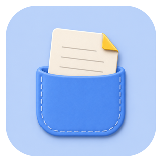

<p align="center">
  
</p>

<h1 align="center">Backpocket</h1>

<p align="center">
  <strong>일단 넣어두고, 필요할 때 꺼내세요.</strong><br>
  정리하기 전의 것들을 위한 macOS 백포켓.
</p>

<p align="center"><a href="README.md">English</a> · <strong>한국어</strong></p>

<p align="center">
  <a href="https://github.com/m2na7/backpocket"></a>
  <a href="Package.swift"></a>
  <a href="LICENSE"></a>
</p>

지금 당장 정리할 시간은 없지만 잊고 싶지는 않은 것들이 있습니다. 링크, 문장, 이미지, 파일, 방금 떠오른 생각을 **일단 Backpocket에 넣어두세요.**

## 기능

- **포커스를 빼앗지 않아요.** 패널이 비활성 창이라 커서가 있던 자리에 그대로 있어요. 열고, 고르고, 붙여넣으면 끝이에요.
- **입력창 하나가 두 가지 일을 해요.** 검색창이 곧 메모 입력창이라, 찾는 동작과 남기는 동작이 같은 몸짓이에요.
- **Enter의 대칭.** 클립과 메모에서 두 동작이 서로 거울처럼 맞물려요.

  | 선택된 항목 | <kbd>Enter</kbd> | <kbd>Cmd+Enter</kbd> |
  |---|---|---|
  | 클립 | 붙여넣기 | — |
  | 메모 | 편집 | 붙여넣기 |

  지금 Enter가 무엇을 할지 항상 칩으로 보여주고, <kbd>Cmd</kbd>를 누르고 있으면 반대쪽 동작을 미리 볼 수 있어요.
- **빠르게 고르기.** <kbd>Cmd+1~9</kbd>로 앞의 아홉 줄을 바로 붙여넣어요. <kbd>Cmd+D</kbd>로 여러 개를 고른 순서대로 모으고, <kbd>Cmd</kbd>를 떼면 줄바꿈으로 이어 붙여 한 번에 넣어요.
- **클립보드가 나르는 모든 것.** 이미지는 썸네일과 함께 들어오고 내용 해시로 중복을 걸러내요. Finder에서 복사한 파일은 경로 문자열이 아니라 **파일 그대로** 남아서, Slack에 붙이면 첨부로 들어가요. HTML과 RTF도 함께 실려서 서식 있는 복사는 서식 그대로, 원하면 깔끔한 마크다운으로 붙어요.
- **링크는 따로 모아요.** URL만 있는 클립은 자기 섹션에도 함께 쌓이고, <kbd>Cmd+O</kbd>로 바로 열어요. 그래도 여전히 평범한 클립이라 붙여넣기·고정·메모 변환이 모두 그대로 동작해요.
- **메모는 메모답게.** 기본 메모 앱처럼 최근순으로 묶이고, 고정한 것이 위에 오며, 편집과 삭제가 행에 붙어 있어요. 메모와 고정 항목은 사라지지 않고, 클립보드 기록만 자동으로 만료돼요(기본 7일).
- **원하는 모양으로.** 메모 열이나 링크 섹션을 끄고, 패널 크기와 가운데 구분선을 조절할 수 있으며 전부 기억해요. 한국어·영어·일본어·중국어 간체를 지원해요.

## 설치

```sh
brew install --cask m2na7/backpocket/backpocket
```

직접 받고 싶다면 [릴리스](https://github.com/m2na7/backpocket/releases/latest)에서 zip을 내려받아 응용 프로그램 폴더에 넣으세요. 어느 쪽이든 이후 업데이트는 앱이 알아서 받아요.

## 단축키

| 단축키 | 동작 |
|---|---|
| <kbd>Shift+Cmd+V</kbd> | 패널 열기 (설정에서 변경 가능) |
| <kbd>↑</kbd> <kbd>↓</kbd> | 이동 |
| <kbd>Tab</kbd> | 섹션 전환 |
| <kbd>Enter</kbd> / <kbd>Cmd+Enter</kbd> | 위의 대칭 표대로 |
| <kbd>Cmd+1~9</kbd> | 현재 섹션의 1~9번째 붙여넣기 |
| <kbd>Cmd+D</kbd> | 모으기 — <kbd>Cmd</kbd>를 떼면 한 번에 붙여넣기 |
| <kbd>Cmd+O</kbd> | 선택한 링크 열기 |
| <kbd>Cmd+P</kbd> | 고정 / 해제 |
| <kbd>Cmd+E</kbd> | 메모 편집 |
| <kbd>Cmd+Backspace</kbd> | 삭제 |
| <kbd>Cmd+,</kbd> | 설정 |
| <kbd>Esc</kbd> | 닫기 |

## 개인정보

클립보드를 다루는 도구인 만큼, 개인정보 보호는 선택이 아니에요.

- **기본은 로컬이에요.** 분석도 텔레메트리도 계정도 서버도 없어요. 복사한 내용은 이 기기를 벗어나지 않아요. 기록과 메모는 `~/Library/Application Support/Backpocket`에 있고, 그 폴더를 지우면 함께 사라져요.
- **업데이트 확인은 켜져 있어요.** HTTPS로 버전 정보 파일을 받아오고, 서명이 유효하지 않으면 아무것도 설치하지 않아요. 이 요청에는 사용자를 식별할 정보가 담기지 않으며, 이 프로젝트가 실사용자 수를 아는 유일한 방법이에요. 설정 > 일반에서 끌 수 있어요.
- **유일한 예외는 링크 파비콘이며 기본은 꺼져 있어요.** 켜면 각 링크의 사이트에 HTTPS로 아이콘을 요청해요. 해당 도메인에 직접 요청하며, 제3자 파비콘 서비스를 거치지 않고, 로컬이나 사설 주소에는 요청하지 않아요. 결과는 2주간 캐시되고 설정에서 지울 수 있어요.
- **비밀번호 관리자의 내용은 기록하지 않아요.** 비밀번호 관리자가 쓰는 `org.nspasteboard.ConcealedType` 표시를 존중하며, `TransientType`과 `AutoGeneratedType`도 함께 따라요.
- **앱별 제외 목록.** 특정 앱에서 복사한 내용은 아예 기록하지 않도록 지정할 수 있어요.
- **손쉬운 사용 권한은 선택이에요.** 다만 기본값 경로에 있어요. "자동으로 붙여넣기"가 켜진 채로 출시되고 그 설정만이 이 권한을 필요로 하므로, 끄면 권한이 전혀 필요 없어요. 그때는 항목을 고르면 클립보드에 올라가고, 붙여넣기는 직접 하면 돼요.

## 기여

클립과 메모는 SwiftData 한 테이블의 같은 행이에요. 편의를 위한 지름길이 아니라 이 제품의 논지 자체예요. AppKit `NSPanel` 위에 SwiftUI를 얹었고, 서드파티 의존성은 Sparkle 하나뿐이에요.

[CONTRIBUTING.md](CONTRIBUTING.md) · [아키텍처](docs/ARCHITECTURE.md)

## 라이선스

[MIT](LICENSE) © 2026 m2na7
