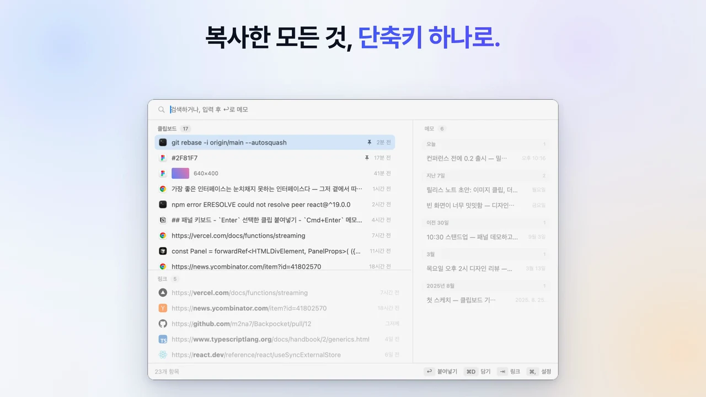
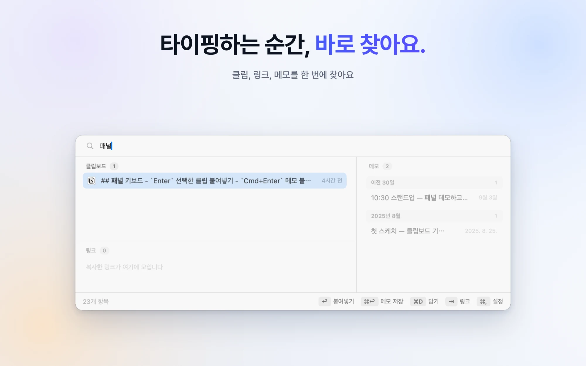
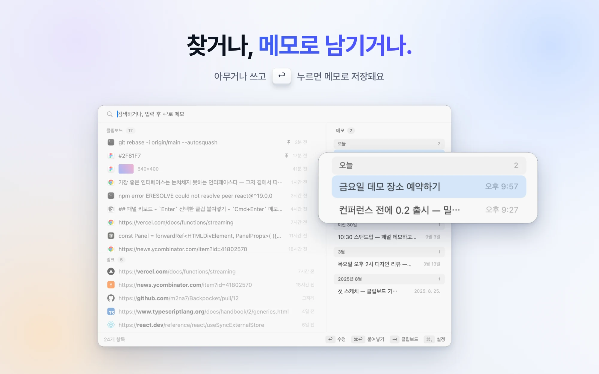
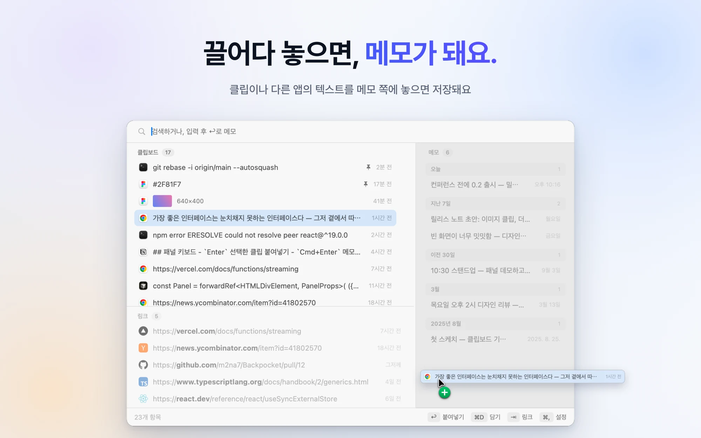
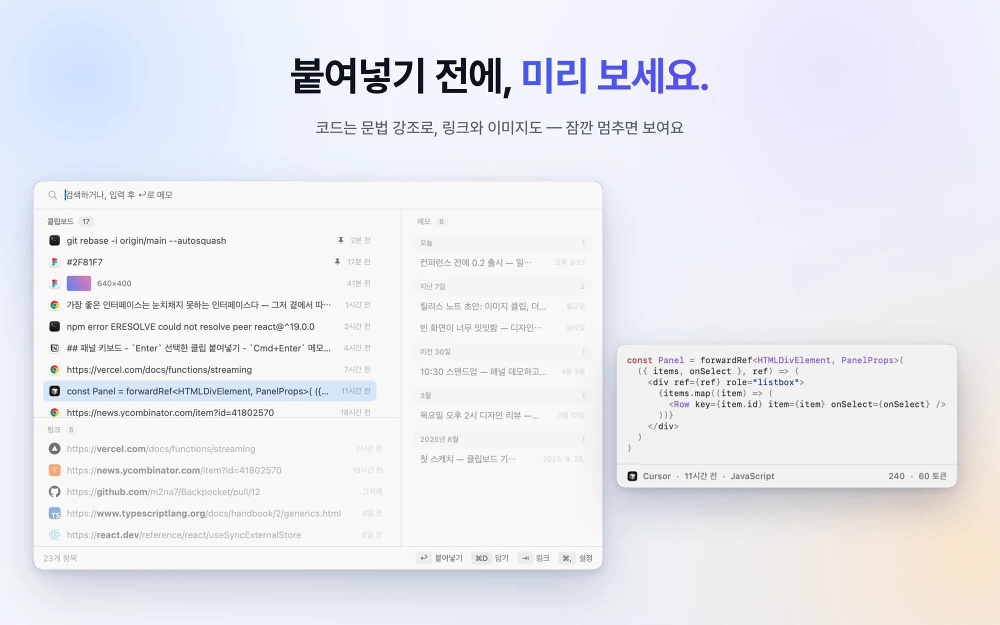
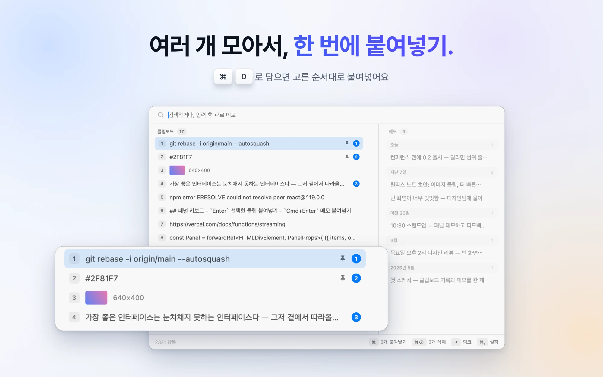
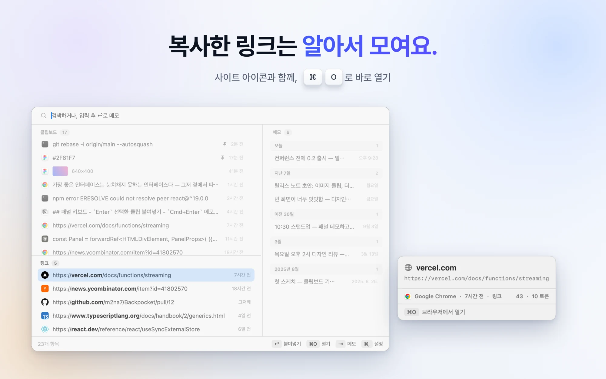
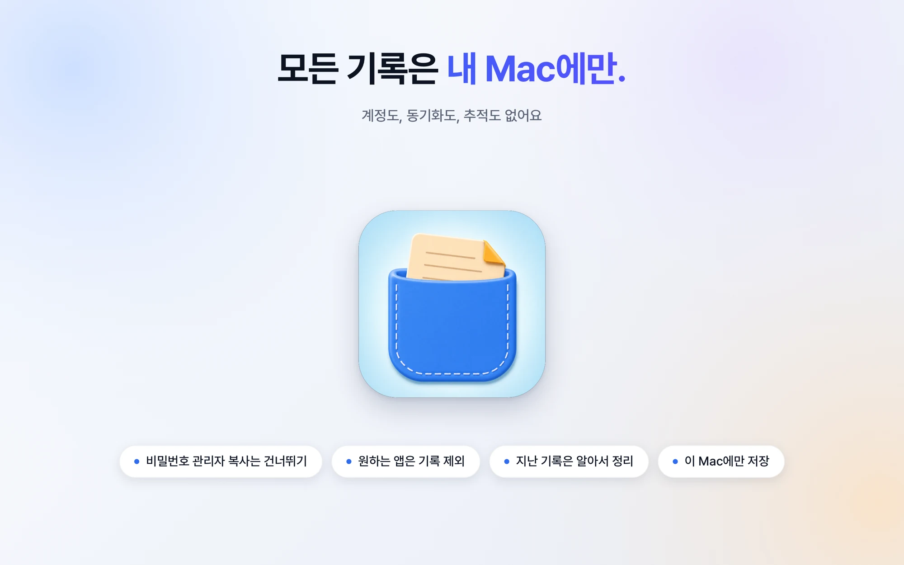

<p align="center">
  
</p>

<h1 align="center">Backpocket</h1>

<p align="center">
  <strong>복사한 모든 것, 단축키 하나로.</strong><br>
  클립보드 기록과 메모를 한 패널에 담은 Mac 앱.
</p>

<p align="center">
  <a href="https://apps.apple.com/kr/app/id6807467186"></a>
  <a href="#설치"></a>
  <a href="https://github.com/m2na7/Backpocket/releases/latest"></a>
  
  <a href="LICENSE"></a>
</p>

<p align="center"><a href="README.md">English</a> · <strong>한국어</strong></p>

<p align="center">
  
</p>

지금 당장 정리할 시간은 없지만 잊고 싶지는 않은 것들이 있습니다. 링크, 문장, 이미지, 파일, 방금 떠오른 생각을 **일단 Backpocket에 넣어두세요.**

## 자세히 보기

<table>
  <tr>
    <td width="64%"></td>
    <td><h3>타이핑하는 순간, 바로 찾아요.</h3><p>클립, 링크, 메모를 한 번에 찾아요. 한 글자씩 칠 때마다 목록이 좁혀져요.</p></td>
  </tr>
  <tr>
    <td width="64%"></td>
    <td><h3>찾거나, 메모로 남기거나.</h3><p>찾는 게 없을 때 <kbd>Enter</kbd>를 누르면 그대로 메모가 돼서 맨 위에 올라가요.</p></td>
  </tr>
  <tr>
    <td width="64%"></td>
    <td><h3>끌어다 놓으면, 메모가 돼요.</h3><p>클립을 메모 쪽에 끌어다 놓으면 그대로 메모가 돼요. 다른 앱의 텍스트를 끌어와도 돼요.</p></td>
  </tr>
  <tr>
    <td width="64%"></td>
    <td><h3>붙여넣기 전에, 미리 보세요.</h3><p>한 줄에서 잠깐 멈추면 카드로 전체 내용을 보여 줘요. 코드는 문법 강조로, 링크와 이미지도요.</p></td>
  </tr>
  <tr>
    <td width="64%"></td>
    <td><h3>여러 개 모아서, 한 번에 붙여넣기.</h3><p><kbd>Cmd+D</kbd>로 하나씩 담으면 고른 순서대로 한 번에 붙여넣어요.</p></td>
  </tr>
  <tr>
    <td width="64%"></td>
    <td><h3>복사한 링크는 알아서 모여요.</h3><p>링크는 사이트 아이콘과 함께 따로 모이고, <kbd>Cmd+O</kbd>로 바로 열어요.</p></td>
  </tr>
  <tr>
    <td width="64%"></td>
    <td><h3>모든 기록은 내 Mac에만.</h3><p>계정도, 동기화도, 추적도 없어요. 비밀번호 관리자는 건너뛰고, 원하는 앱은 기록에서 뺄 수 있어요.</p></td>
  </tr>
</table>

## 기능

- **포커스를 빼앗지 않아요.** 패널이 비활성 창이라 커서가 있던 자리에 그대로 있어요. 열고, 고르고, 붙여넣으면 끝이에요.
- **입력창 하나가 두 가지 일을 해요.** 검색창이 곧 메모 입력창이라, 찾는 동작과 남기는 동작이 같은 몸짓이에요.
- **Enter의 대칭.** 클립과 메모에서 두 동작이 서로 거울처럼 맞물려요.

  | 선택된 항목 | <kbd>Enter</kbd> | <kbd>Cmd+Enter</kbd> |
  |---|---|---|
  | 클립 | 붙여넣기 | — |
  | 메모 | 편집 | 붙여넣기 |

  지금 Enter가 무엇을 할지 항상 칩으로 보여주고, <kbd>Cmd</kbd>를 누르고 있으면 반대쪽 동작을 미리 볼 수 있어요.
- **빠르게 고르기.** <kbd>Cmd+1~9</kbd>로 앞의 아홉 줄을 바로 붙여넣어요. <kbd>Cmd+D</kbd>로 여러 개를 고른 순서대로 모으고, <kbd>Cmd</kbd>를 떼면 줄바꿈으로 이어 붙여 한 번에 넣어요.
- **클립보드가 나르는 모든 것.** 이미지는 썸네일과 함께 들어오고 내용 해시로 중복을 걸러내요. HTML과 RTF도 함께 실려서 서식 있는 복사는 서식 그대로, 원하면 깔끔한 마크다운으로 붙어요.
- **메모는 메모답게.** 기본 메모 앱처럼 최근순으로 묶이고, 고정한 것이 위에 와요. 메모와 고정 항목은 사라지지 않고, 클립보드 기록만 자동으로 만료돼요(기본 7일).
- **원하는 모양으로.** 메모 열이나 링크 섹션을 끄고, 패널 크기와 가운데 구분선을 조절하고, 단축키도 원하는 대로 바꿀 수 있어요. 한국어·영어·일본어·중국어 간체를 지원하고, VoiceOver에서도 각 행을 제대로 읽어줘요.
- **기기 안에 머물러요.** 계정도 동기화도 서버도 분석도 없어요. 비밀번호 관리자의 내용은 건너뛰고(`org.nspasteboard.ConcealedType`), 특정 앱은 아예 제외할 수 있어요. 네트워크로 나가는 건 링크 파비콘과, 직접 다운로드판의 업데이트 확인뿐이고 둘 다 설정에서 끌 수 있어요.

## 설치

**Mac App Store**: [Backpocket: Clipboard & Notes](https://apps.apple.com/kr/app/id6807467186). 프로젝트를 응원하는 방법이에요.

**Homebrew** (무료):

```sh
brew install --cask m2na7/backpocket/backpocket
```

직접 받고 싶다면 [릴리스](https://github.com/m2na7/Backpocket/releases/latest)에서 zip을 내려받아 응용 프로그램 폴더에 넣으세요. 직접 다운로드판은 이후 업데이트를 앱이 알아서 받아요.

## 단축키

| 단축키 | 동작 |
|---|---|
| <kbd>Shift+Cmd+V</kbd> | 패널 열기 |
| <kbd>↑</kbd> <kbd>↓</kbd> | 이동 |
| <kbd>Tab</kbd> | 섹션 전환 |
| <kbd>Enter</kbd> / <kbd>Cmd+Enter</kbd> | 위의 대칭 표대로 |
| <kbd>Cmd+1~9</kbd> | 현재 섹션의 1~9번째 붙여넣기 |
| <kbd>Cmd+D</kbd> | 모으기 — <kbd>Cmd</kbd>를 떼면 한 번에 붙여넣기 |
| <kbd>Cmd+O</kbd> | 선택한 링크 열기 |
| <kbd>Cmd+P</kbd> | 고정 / 해제 |
| <kbd>Cmd+E</kbd> | 메모 편집 |
| <kbd>Cmd+Backspace</kbd> | 삭제 |
| <kbd>Cmd+,</kbd> | 설정 |
| <kbd>Esc</kbd> | 닫기 |

위 단축키는 모두 설정에서 바꿀 수 있어요.

## 기여

[CONTRIBUTING.md](CONTRIBUTING.md) · [아키텍처](docs/ARCHITECTURE.md)

## 라이선스

[MIT](LICENSE) © 2026 m2na7
