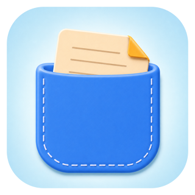

<p align="center">
  
</p>

<h1 align="center">Backpocket</h1>

<p align="center">
  <strong>Put it away now. Pull it out when you need it.</strong><br>
  A pocket for everything you haven't organized yet.
</p>

<p align="center"><strong>English</strong> · <a href="README.ko.md">한국어</a></p>

<p align="center">
  <a href="https://github.com/m2na7/Backpocket"></a>
  <a href="Package.swift"></a>
  <a href="LICENSE"></a>
</p>

Some things are worth keeping even when you don't have time to organize them. Put links, snippets, images, files, and passing thoughts in **Backpocket** for now.

## Features

- **Never steals focus.** The panel is non-activating, so your cursor stays where it was. Open it, pick, paste.
- **One field, two jobs.** The search field doubles as note entry — filtering and capturing are the same gesture.
- **Enter symmetry.** The two actions mirror across clips and notes:

  | Selected | <kbd>Enter</kbd> | <kbd>Cmd+Enter</kbd> |
  |---|---|---|
  | Clip | Paste | — |
  | Note | Edit | Paste |

  A chip always shows what Enter will do right now; hold <kbd>Cmd</kbd> to peek at the inverse.
- **Fast picking.** <kbd>Cmd+1..9</kbd> pastes any of the first nine rows. <kbd>Cmd+D</kbd> collects a handful in pick order, and letting go of <kbd>Cmd</kbd> pastes them joined by newlines.
- **Everything the clipboard carries.** Images arrive with a thumbnail and dedupe by content hash. A Finder copy stays a *file*, so it lands in Slack as an attachment rather than a path. HTML and RTF ride along, so rich copies paste back rich — or as clean Markdown if you'd rather.
- **Links, collected.** URL-only clips also file under their own section, with <kbd>Cmd+O</kbd> to open one. They stay ordinary clips underneath, so paste, pin and conversion keep working.
- **Notes read like notes.** Grouped by recency the way the Notes app does it, pinned on top, edit and delete on the row. Notes and pinned items never expire; clipboard history does (default: 7 days).
- **Yours to shape.** Turn off the notes column or the links section, resize the panel, move the divider, rebind any shortcut — all remembered. Localized in English, Korean, Japanese and Simplified Chinese, and the rows read aloud properly under VoiceOver.
- **Stays on your machine.** No account, no sync, no server, no analytics. Password managers are skipped (`org.nspasteboard.ConcealedType`), and any app can be excluded outright. Two things do reach the network and both are switches in Settings: update checks, and the favicons that link rows wear.

## Install

```sh
brew install --cask m2na7/backpocket/backpocket
```

Prefer to do it by hand? Take the zip from [Releases](https://github.com/m2na7/Backpocket/releases/latest) and drop it in Applications. Either way it updates itself from then on.

## Keyboard

| Shortcut | Action |
|---|---|
| <kbd>Shift+Cmd+V</kbd> | Open the panel |
| <kbd>↑</kbd> <kbd>↓</kbd> | Navigate |
| <kbd>Tab</kbd> | Switch section |
| <kbd>Enter</kbd> / <kbd>Cmd+Enter</kbd> | Per the symmetry table above |
| <kbd>Cmd+1..9</kbd> | Paste row 1–9 of the focused section |
| <kbd>Cmd+D</kbd> | Collect — releasing <kbd>Cmd</kbd> pastes the handful |
| <kbd>Cmd+O</kbd> | Open the selected link |
| <kbd>Cmd+P</kbd> | Pin / unpin |
| <kbd>Cmd+E</kbd> | Edit note |
| <kbd>Cmd+Backspace</kbd> | Delete |
| <kbd>Cmd+,</kbd> | Settings |
| <kbd>Esc</kbd> | Close |

Every shortcut above is rebindable in Settings.

## Contributing

A clip and a note are the same row in one SwiftData table — that is the product thesis, not a shortcut. SwiftUI hosted in an AppKit `NSPanel`, with Sparkle as the only third-party dependency.

[CONTRIBUTING.md](CONTRIBUTING.md) · [Architecture](docs/ARCHITECTURE.md)

## License

[MIT](LICENSE) © 2026 m2na7
