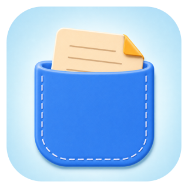
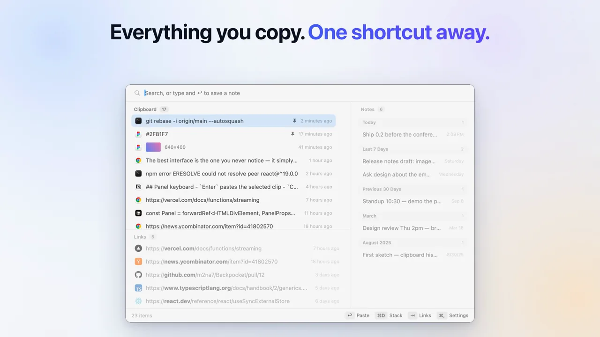
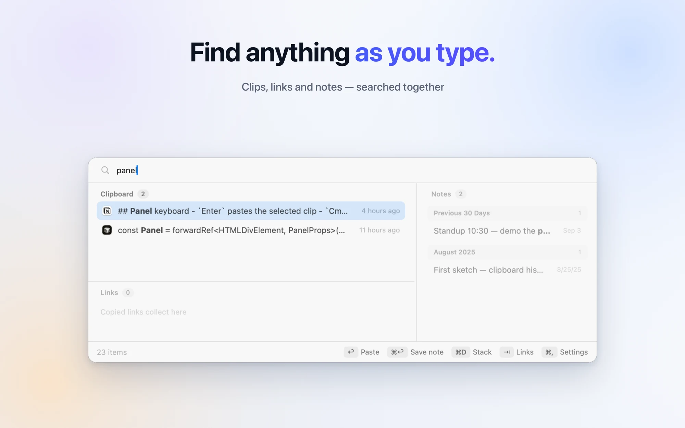
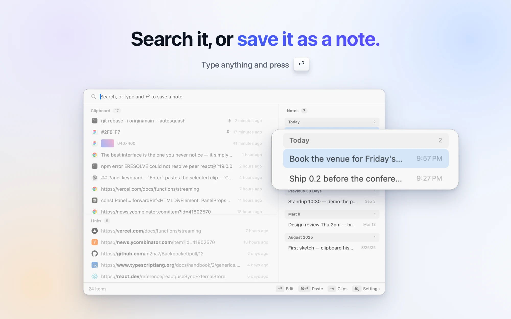
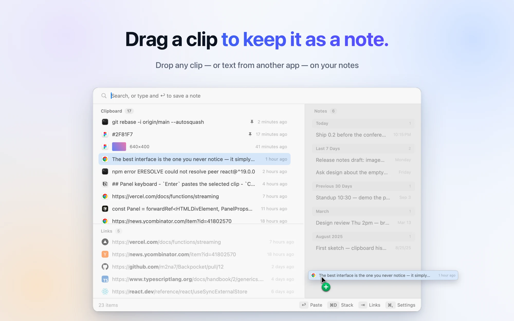
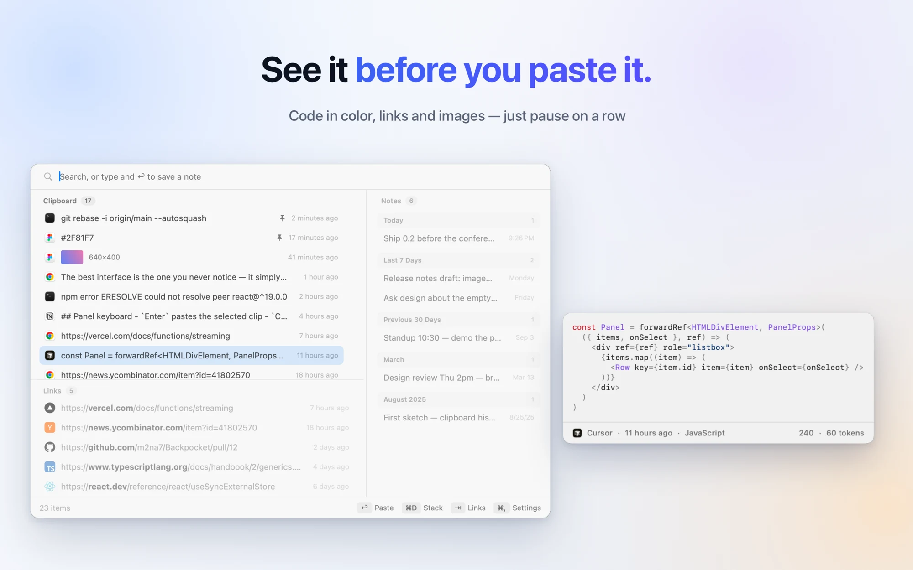
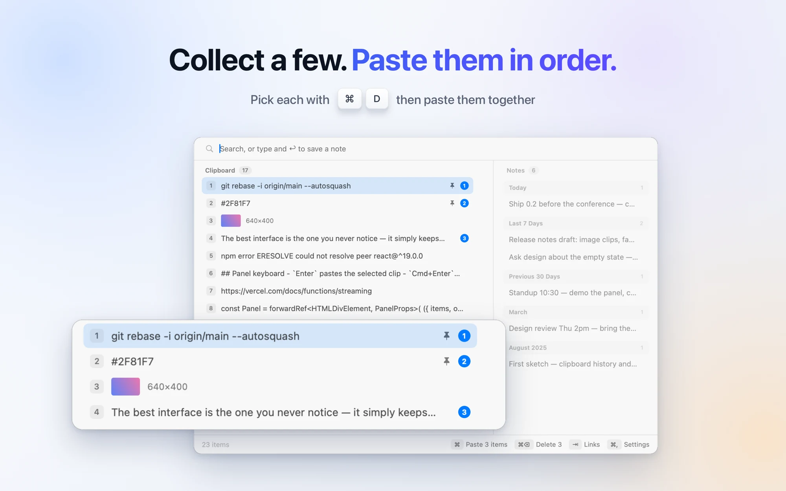
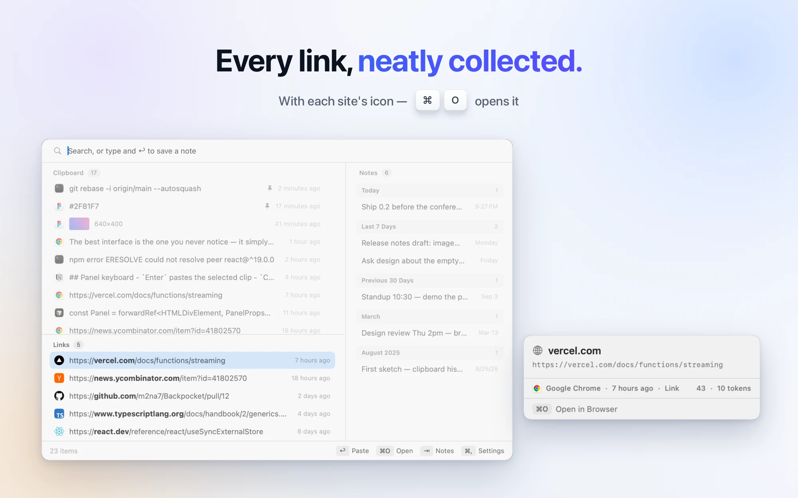
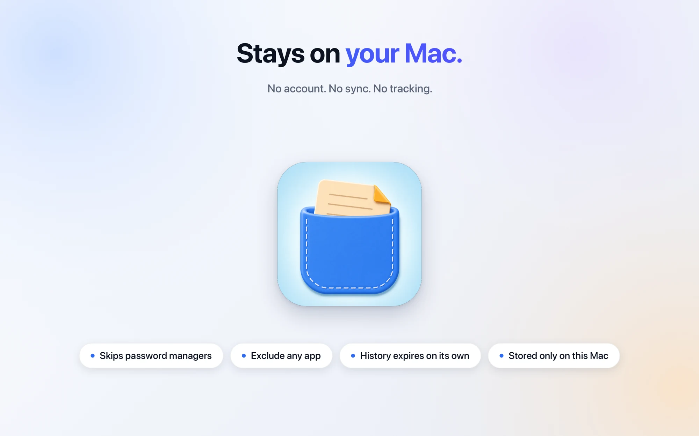

<p align="center">
  
</p>

<h1 align="center">Backpocket</h1>

<p align="center">
  <strong>Everything you copy. One shortcut away.</strong><br>
  Clipboard history and notes in one panel for your Mac.
</p>

<p align="center">
  <a href="https://apps.apple.com/app/id6807467186"></a>
  <a href="#install"></a>
  <a href="https://github.com/m2na7/Backpocket/releases/latest"></a>
  
  <a href="LICENSE"></a>
</p>

<p align="center"><strong>English</strong> · <a href="README.ko.md">한국어</a></p>

<p align="center">
  
</p>

Some things are worth keeping even when you don't have time to organize them. Put links, snippets, images, files, and passing thoughts in **Backpocket** for now.

## A closer look

<table>
  <tr>
    <td width="64%"></td>
    <td><h3>Find anything as you type.</h3><p>Clips, links and notes, searched together — the list narrows with every key.</p></td>
  </tr>
  <tr>
    <td width="64%"></td>
    <td><h3>Search it, or save it as a note.</h3><p>Type something that matches nothing and press <kbd>Enter</kbd>. It lands at the top of your notes.</p></td>
  </tr>
  <tr>
    <td width="64%"></td>
    <td><h3>Drag a clip to keep it as a note.</h3><p>Drop any clip on the notes column and it becomes a note. Text dragged in from another app works too.</p></td>
  </tr>
  <tr>
    <td width="64%"></td>
    <td><h3>See it before you paste it.</h3><p>Pause on a row and a card shows it in full: code in color, links and images.</p></td>
  </tr>
  <tr>
    <td width="64%"></td>
    <td><h3>Collect a few, paste them in order.</h3><p><kbd>Cmd+D</kbd> picks each one; they paste together in the order you chose.</p></td>
  </tr>
  <tr>
    <td width="64%"></td>
    <td><h3>Every link, neatly collected.</h3><p>Copied links gather in their own section with each site's icon. <kbd>Cmd+O</kbd> opens one.</p></td>
  </tr>
  <tr>
    <td width="64%"></td>
    <td><h3>Stays on your Mac.</h3><p>No account, no sync, no tracking. Password managers are skipped, and any app can be excluded.</p></td>
  </tr>
</table>

## Features

- **Never steals focus.** The panel is non-activating, so your cursor stays where it was. Open it, pick, paste.
- **One field, two jobs.** The search field doubles as note entry — filtering and capturing are the same gesture.
- **Enter symmetry.** The two actions mirror across clips and notes:

  | Selected | <kbd>Enter</kbd> | <kbd>Cmd+Enter</kbd> |
  |---|---|---|
  | Clip | Paste | — |
  | Note | Edit | Paste |

  A chip always shows what Enter will do right now; hold <kbd>Cmd</kbd> to peek at the inverse.
- **Fast picking.** <kbd>Cmd+1..9</kbd> pastes any of the first nine rows. <kbd>Cmd+D</kbd> collects a handful in pick order, and letting go of <kbd>Cmd</kbd> pastes them joined by newlines.
- **Everything the clipboard carries.** Images arrive with a thumbnail and dedupe by content hash. HTML and RTF ride along, so rich copies paste back rich — or as clean Markdown if you'd rather.
- **Notes read like notes.** Grouped by recency the way the Notes app does it, pinned on top. Notes and pinned items never expire; clipboard history does (default: 7 days).
- **Yours to shape.** Turn off the notes column or the links section, resize the panel, move the divider, rebind any shortcut. Localized in English, Korean, Japanese and Simplified Chinese, and the rows read aloud properly under VoiceOver.
- **Stays on your machine.** No account, no sync, no server, no analytics. Password managers are skipped (`org.nspasteboard.ConcealedType`), and any app can be excluded outright. The only network requests are link favicons and, in the direct download, update checks — both switchable off in Settings.

## Install

**Mac App Store** — [Backpocket: Clipboard & Notes](https://apps.apple.com/app/id6807467186). Buying it supports the project.

**Homebrew**, free:

```sh
brew install --cask m2na7/backpocket/backpocket
```

Or take the zip from [Releases](https://github.com/m2na7/Backpocket/releases/latest) and drop it in Applications. The direct download updates itself from then on.

## Keyboard

| Shortcut | Action |
|---|---|
| <kbd>Shift+Cmd+V</kbd> | Open the panel |
| <kbd>↑</kbd> <kbd>↓</kbd> | Navigate |
| <kbd>Tab</kbd> | Switch section |
| <kbd>Enter</kbd> / <kbd>Cmd+Enter</kbd> | Per the symmetry table above |
| <kbd>Cmd+1..9</kbd> | Paste row 1–9 of the focused section |
| <kbd>Cmd+D</kbd> | Collect — releasing <kbd>Cmd</kbd> pastes the handful |
| <kbd>Cmd+O</kbd> | Open the selected link |
| <kbd>Cmd+P</kbd> | Pin / unpin |
| <kbd>Cmd+E</kbd> | Edit note |
| <kbd>Cmd+Backspace</kbd> | Delete |
| <kbd>Cmd+,</kbd> | Settings |
| <kbd>Esc</kbd> | Close |

Every shortcut above is rebindable in Settings.

## Contributing

[CONTRIBUTING.md](CONTRIBUTING.md) · [Architecture](docs/ARCHITECTURE.md)

## License

[MIT](LICENSE) © 2026 m2na7
